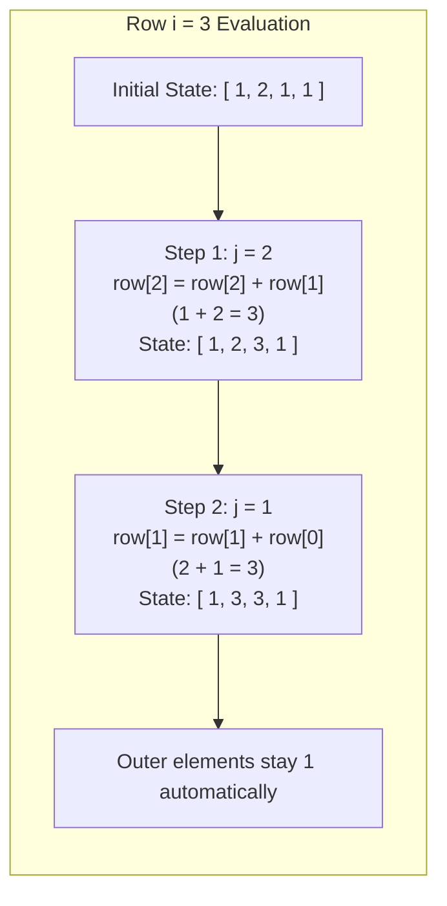

<h2><a href="https://leetcode.com/problems/pascals-triangle-ii">0000. Pascals Triangle Ii</a></h2>

<p>Given an integer <code>rowIndex</code>, return the <code>rowIndex<sup>th</sup></code> (<strong>0-indexed</strong>) row of the <strong>Pascal's triangle</strong>.</p>

<p>In <strong>Pascal's triangle</strong>, each number is the sum of the two numbers directly above it as shown:</p>

<p>&nbsp;</p>
<p><strong class="example">Example 1:</strong></p>
<pre><strong>Input:</strong> rowIndex = 3
<strong>Output:</strong> [1,3,3,1]
</pre><p><strong class="example">Example 2:</strong></p>
<pre><strong>Input:</strong> rowIndex = 0
<strong>Output:</strong> [1]
</pre><p><strong class="example">Example 3:</strong></p>
<pre><strong>Input:</strong> rowIndex = 1
<strong>Output:</strong> [1,1]
</pre>
<p>&nbsp;</p>
<p><strong>Constraints:</strong></p>

<ul>
	<li><code>0 &lt;= rowIndex &lt;= 33</code></li>
</ul>

<p>&nbsp;</p>
<p><strong>Follow up:</strong> Could you optimize your algorithm to use only <code>O(rowIndex)</code> extra space?</p>


---

# 🛍️ Pascals-Triangle-Ii | Explained

## Approach 1: In-Place Reverse Dynamic Programming (Rolling 1D Array)

### Intuition
In Pascal's Triangle, each value is the sum of the two values directly above it:
$$\text{Triangle}[i][j] = \text{Triangle}[i-1][j-1] + \text{Triangle}[i-1][j]$$

A naive approach creates the entire 2D triangle up to `rowIndex`, which consumes $O(k^2)$ auxiliary memory (where $k = \text{rowIndex}$). However, to compute any given row, we only ever need access to the values of the row immediately preceding it. 

Think of this like renovating a row of houses. If you need to rebuild each house based on its current state and its left-side neighbor's state, moving from **left to right** causes a problem: the moment you demolish and rebuild house $j$, house $j+1$ can no longer look at the *original* house $j$. It sees the newly renovated version instead. 

To prevent overwriting data before it is read, you work **backwards from right to left**. Updating element $j$ using its previous value and element $j - 1$ leaves element $j - 1$ intact for the next calculation.

---

### Algorithm Visualized

When updating from row $i = 2$ (`[1, 2, 1, 1]`) to row $i = 3$ (`[1, 3, 3, 1]`):



---

### Approach

1. **Allocate the Vector:**
   Initialize a 1D vector `row` of size `rowIndex + 1`, pre-filling all elements with `1`. This inherently solves the boundary condition where the first and last elements of any row in Pascal's triangle are always `1`.
2. **Outer Loop (`i` from 2 to `rowIndex`):**
   Rows `0` (`[1]`) and `1` (`[1, 1]`) are already valid upon initialization. The outer loop simulates the sequential generation of each subsequent row starting from row `2` up to `rowIndex`.
3. **Inner Loop (`j` from `i - 1` down to 1):**
   For row `i`, the internal elements to compute sit between index `1` and `i - 1`. By iterating backwards:
   $$\text{row}[j] = \text{row}[j] + \text{row}[j - 1]$$
   Here, $\text{row}[j]$ represents the value from row $i-1$ at column $j$, and $\text{row}[j-1]$ represents the value from row $i-1$ at column $j-1$.
4. **Return:**
   After the outer loop finishes, the array contains the exact values of `rowIndex`.

---

### Detailed Code Analysis

```cpp
class Solution {
public:
    vector<int> getRow(int rowIndex){
        // Line 4: Allocate a vector of size (rowIndex + 1) filled with 1s.
        // For rowIndex = 3, row begins as: [1, 1, 1, 1].
        // This pre-sets row[0] = 1 and row[i] = 1 for all steps.
        vector<int> row(rowIndex + 1, 1);
        
        // Line 5: Iterate row-by-row starting from the 3rd row (index 2).
        // If rowIndex < 2, the loop condition is false and the pre-filled 
        // vector is returned directly (e.g., rowIndex = 0 -> [1], rowIndex = 1 -> [1, 1]).
        for(int i = 2; i <= rowIndex; ++i){
            
            // Line 6-8: Traverse backwards from the inner boundary (i - 1) down to 1.
            // Iterating backwards is crucial: row[j - 1] is guaranteed to be 
            // the value from iteration (i - 1), unaffected by the current row's updates.
            for(int j = i - 1; j > 0; --j){
                row[j] += row[j - 1];
            }
        }
        
        // Line 10: The vector now holds the complete rowIndex-th level.
        return row;
    }
};
```

---

### Code

```cpp
class Solution {
public:
    vector<int> getRow(int rowIndex){
        vector<int> row(rowIndex + 1, 1);
        for(int i = 2; i <= rowIndex; ++i){
            for(int j = i - 1; j > 0; --j){
                row[j] += row[j - 1];
            }
        }
        return row;
    }
};
```

---

### Complexity

- **Time Complexity:** $O(\text{rowIndex}^2)$
  The outer loop runs $\text{rowIndex} - 1$ times. In each iteration $i$, the inner loop executes $i - 1$ times:
  $$\sum_{i=2}^{\text{rowIndex}} (i - 1) = 1 + 2 + 3 + \dots + (\text{rowIndex} - 1) = \frac{(\text{rowIndex})(\text{rowIndex} - 1)}{2} = O(k^2)$$
  For the maximum LeetCode constraint ($\text{rowIndex} = 33$), the inner loop executes at most $\approx 528$ operations, running in sub-millisecond time.

- **Space Complexity:** $O(1)$ auxiliary space
  The algorithm modifies a single vector of size $\text{rowIndex} + 1$ in-place. Excluding the output array required by the problem signature, the auxiliary memory used is $O(1)$ (only loop counters `i` and `j`).

---

## 🕵️‍♂️ Follow-up Questions (Optional)

### 1. Can we optimize the time complexity to $O(k)$?
**Answer:** Yes. Each element in row $n$ corresponds to the combination formula:
$$C(n, k) = \binom{n}{k} = \frac{n!}{k!(n-k)!}$$
Using the multiplicative relationship between consecutive elements:
$$\binom{n}{k} = \binom{n}{k-1} \times \frac{n - k + 1}{k}$$
You can compute each subsequent element in $O(1)$ time, yielding an overall $O(k)$ time complexity. However, intermediate products can overflow a standard 32-bit signed integer, requiring 64-bit integer types (`long long`) during computation before casting back to `int`.
