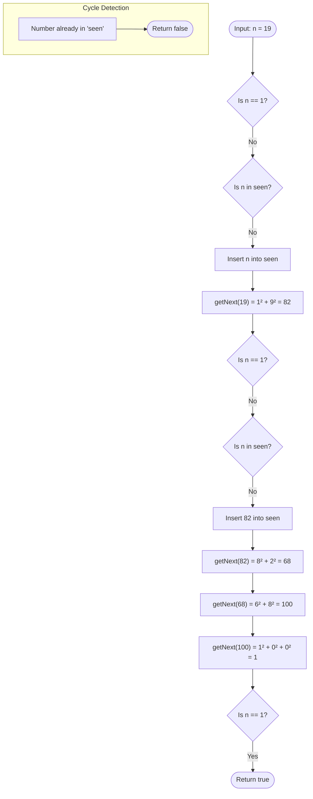

<h2><a href="https://leetcode.com/problems/happy-number">202. Happy Number</a></h2>

<p>Write an algorithm to determine if a number <code>n</code> is happy.</p>

<p>A <strong>happy number</strong> is a number defined by the following process:</p>

<ul>
	<li>Starting with any positive integer, replace the number by the sum of the squares of its digits.</li>
	<li>Repeat the process until the number equals 1 (where it will stay), or it <strong>loops endlessly in a cycle</strong> which does not include 1.</li>
	<li>Those numbers for which this process <strong>ends in 1</strong> are happy.</li>
</ul>

<p>Return <code>true</code> <em>if</em> <code>n</code> <em>is a happy number, and</em> <code>false</code> <em>if not</em>.</p>

<p>&nbsp;</p>
<p><strong class="example">Example 1:</strong></p>

<pre><strong>Input:</strong> n = 19
<strong>Output:</strong> true
<strong>Explanation:</strong>
1<sup>2</sup> + 9<sup>2</sup> = 82
8<sup>2</sup> + 2<sup>2</sup> = 68
6<sup>2</sup> + 8<sup>2</sup> = 100
1<sup>2</sup> + 0<sup>2</sup> + 0<sup>2</sup> = 1
</pre>

<p><strong class="example">Example 2:</strong></p>

<pre><strong>Input:</strong> n = 2
<strong>Output:</strong> false
</pre>

<p>&nbsp;</p>
<p><strong>Constraints:</strong></p>

<ul>
	<li><code>1 &lt;= n &lt;= 2<sup>31</sup> - 1</code></li>
</ul>


---

# 🛍️ Happy-Number | Explained

## Approach 1: Hash Set Cycle Detection

### Intuition

Imagine you are hiking through an unfamiliar trail network where every trail junction is numbered. At each junction, a deterministic rule calculates your next destination. There are only two possible outcomes:
1. You eventually arrive at the destination shelter (the number `1`).
2. You find yourself walking in circles, passing a trail marker you have already seen before.

To prevent hiking endlessly in a loop, you record every marker you visit in a notebook. If you ever hit `1`, you successfully finish. If you encounter a number already written down in your notebook, you know with absolute certainty that you are trapped in an infinite cycle and can never reach `1`.

In mathematical terms, replacing a number with the sum of the squares of its digits will either reduce to `1` or fall into a known closed cycle (such as the cycle `4 → 16 → 37 → 58 → 89 → 145 → 42 → 20 → 4`). By storing previously seen states in a hash set, we detect cycles in $\mathcal{O}(1)$ average lookup time.

---

### Algorithm Visualized



---

### Approach

1. **Helper Function (`getNext`)**:
   - Extract the last digit of `n` using the modulo operator `n % 10`.
   - Square the extracted digit and add it to a running accumulator `totalSum`.
   - Remove the last digit using integer division `n / 10`.
   - Repeat until `n` becomes `0`, then return `totalSum`.

2. **Main Function (`isHappy`)**:
   - Instantiate a hash set `std::unordered_set<int> seen` to store visited numbers.
   - Run a `while` loop with two termination conditions:
     - `n == 1`: The target state is reached; the number is happy.
     - `seen.find(n) != seen.end()`: The current number has been seen before; an infinite cycle is detected.
   - Inside the loop, record `n` in `seen` and replace `n` with `getNext(n)`.
   - Return `true` if loop exited because `n == 1`, otherwise return `false`.

---

### Detailed Code Analysis

#### 1. Helper Function: `getNext(int n)`
```cpp
private:
    int getNext(int n) {
        int totalSum = 0;
        while (n > 0) {
            int d = n % 10;
            n = n / 10;
            totalSum += d * d;
        }
        return totalSum;
    }
```
- **Line 4 (`int totalSum = 0;`)**: Initializes the accumulator to store the sum of squared digits.
- **Lines 5–9 (`while (n > 0)`)**: 
  - `int d = n % 10;`: Isolates the least significant digit.
  - `n = n / 10;`: Truncates the least significant digit, shifting all digits right.
  - `totalSum += d * d;`: Squares the isolated digit and aggregates it into `totalSum`.
- **Line 10 (`return totalSum;`)**: Returns the new transformed value.

#### 2. Main Logic: `isHappy(int n)`
```cpp
public:
    bool isHappy(int n) {
        std::unordered_set<int> seen;
        while (n != 1 && seen.find(n) == seen.end()) {
            seen.insert(n);
            n = getNext(n);
        }
        return n == 1;
    }
```
- **Line 13 (`std::unordered_set<int> seen;`)**: Uses an open-addressing / chained hash table (`unordered_set`) providing $\mathcal{O}(1)$ average-time lookups and insertions.
- **Line 14 (`while (n != 1 && seen.find(n) == seen.end())`)**: Evaluates whether `n` has reached the happy state (`1`) or whether `n` has already been recorded in `seen`. If either condition fails, the loop terminates immediately.
- **Line 15 (`seen.insert(n);`)**: Registers the current number as visited.
- **Line 16 (`n = getNext(n);`)**: Computes the next state in the sequence.
- **Line 19 (`return n == 1;`)**: If the loop exited because `n == 1`, returns `true`. If it exited because a cycle was detected, `n != 1` evaluates to `false`.

---

### Code

```cpp
class Solution {
private:
    int getNext(int n) {
        int totalSum = 0;
        while (n > 0) {
            int d = n % 10;
            n = n / 10;
            totalSum += d * d;
        }
        return totalSum;
    }
public:
    bool isHappy(int n) {
        std::unordered_set<int> seen;
        while (n != 1 && seen.find(n) == seen.end()) {
            seen.insert(n);
            n = getNext(n);
        }
        return n == 1;
    }
};
```

---

### Complexity

- **Time Complexity:** $\mathcal{O}(\log n)$
  - Computing `getNext(n)` processes each digit of $n$. The number of digits in $n$ is given by $\lfloor\log_{10} n\rfloor + 1$, taking $\mathcal{O}(\log n)$ time.
  - The maximum possible value for the sum of squares of digits shrinks rapidly. For example, for the largest 32-bit signed integer ($2,147,483,647$), the value with the largest digit sum is $1,999,999,999$, which maps to $1 + 9 \times 9^2 = 730$.
  - Once below $243$ (the maximum sum for 3-digit numbers, $3 \times 81$), numbers stay within a strictly bounded finite set. Within this bounded space, cycle detection occurs in $\mathcal{O}(1)$ steps. Thus, the dominant operation is the initial step: $\mathcal{O}(\log n)$.

- **Space Complexity:** $\mathcal{O}(\log n)$ / $\mathcal{O}(1)$ bounded
  - The hash set stores numbers encountered along the path. Because all numbers rapidly drop below $243$ and either enter the known 8-number cycle or resolve to $1$, the set will never hold more than a small constant number of entries. Hence, auxiliary space is effectively $\mathcal{O}(1)$.

---

## 🕵️‍♂️ Follow-up Questions (Optional)

### 1. How can you optimize the space complexity strictly to $\mathcal{O}(1)$ without using a Hash Set?
**Answer:** You can apply **Floyd's Cycle-Finding Algorithm (Tortoise and Hare)**. Maintain two pointers: a `slow` pointer that advances one step at a time (`slow = getNext(slow)`), and a `fast` pointer that advances two steps (`fast = getNext(getNext(fast))`). If `fast == 1`, the number is happy. If `slow == fast` and not equal to `1`, a cycle exists. This removes the hash set allocation completely.

```cpp
bool isHappy(int n) {
    int slow = n;
    int fast = getNext(n);
    while (fast != 1 && slow != fast) {
        slow = getNext(slow);
        fast = getNext(getNext(fast));
    }
    return fast == 1;
}
```

### 2. Is it mathematically guaranteed that numbers will not grow infinitely?
**Answer:** Yes. For any number with $k \ge 4$ digits, the number itself is at least $10^{k-1}$, while the maximum possible sum of digit squares is $9^2 \times k = 81k$. Since $10^{k-1} > 81k$ for all $k \ge 4$, every step strictly decreases the value of large numbers until they drop below $1000$, ensuring divergence to infinity is impossible.