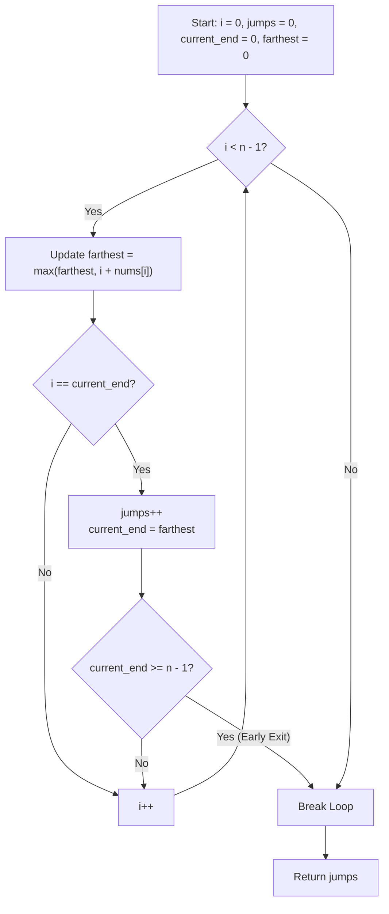

<h2><a href="https://leetcode.com/problems/jump-game-ii">45. Jump Game II</a></h2>

<p>You are given a <strong>0-indexed</strong> array of integers <code>nums</code> of length <code>n</code>. You are initially positioned at&nbsp;index 0.</p>

<p>Each element <code>nums[i]</code> represents the maximum length of a forward jump from index <code>i</code>. In other words, if you are at index <code>i</code>, you can jump to any index <code>(i + j)</code>&nbsp;where:</p>

<ul>
	<li><code>0 &lt;= j &lt;= nums[i]</code> and</li>
	<li><code>i + j &lt; n</code></li>
</ul>

<p>Return <em>the minimum number of jumps to reach index </em><code>n - 1</code>. The test cases are generated such that you can reach index&nbsp;<code>n - 1</code>.</p>

<p>&nbsp;</p>
<p><strong class="example">Example 1:</strong></p>

<pre><strong>Input:</strong> nums = [2,3,1,1,4]
<strong>Output:</strong> 2
<strong>Explanation:</strong> The minimum number of jumps to reach the last index is 2. Jump 1 step from index 0 to 1, then 3 steps to the last index.
</pre>

<p><strong class="example">Example 2:</strong></p>

<pre><strong>Input:</strong> nums = [2,3,0,1,4]
<strong>Output:</strong> 2
</pre>

<p>&nbsp;</p>
<p><strong>Constraints:</strong></p>

<ul>
	<li><code>1 &lt;= nums.length &lt;= 10<sup>4</sup></code></li>
	<li><code>0 &lt;= nums[i] &lt;= 1000</code></li>
	<li>It's guaranteed that you can reach <code>nums[n - 1]</code>.</li>
</ul>


---

# 🛍️ Jump-Game-II | Explained

## Approach 1: Greedy Interval Expansion (Implicit BFS)

### Intuition
Think of this problem like navigating stepping stones across a river in the dark with a lantern. When you stand on a stone, your lantern illuminates a range of stones ahead of you. 

Instead of jumping blindly, you inspect every stone within your current reach (`current_end`) and ask: *"If I were to leap from this stone, how much farther down the river can I see?"* You continuously record the absolute furthest point visible (`farthest`). Once you reach the absolute limit of your current reach (`i == current_end`), you are forced to make a jump. You commit to jumping into that next explored zone, increment your jump counter, and push your boundary forward to `farthest`. 

Because you checked all reachable stones in the current level before committing, you guarantee that every jump extends your reach as far as mathematically possible. This is conceptually an **implicit Breadth-First Search (BFS)**, where each jump represents transitioning to the next BFS depth/level.

### Algorithm Visualized



### Approach
1. **Base Case Check**: If the array contains 1 element or fewer, we are already at the target index `0`. Zero jumps are required.
2. **State Tracking**: Maintain three pointers/trackers:
   - `jumps`: The total number of jumps made so far.
   - `current_end`: The boundary of the current jump reach.
   - `farthest`: The maximum reachable index discovered so far among all visited indices.
3. **Scan the Array**: Iterate `i` from `0` up to `n - 2`. We intentionally stop at `n - 2` because once we arrive at or can cover the last index (`n - 1`), we do not need to calculate jumps originating from it.
4. **Extend Reach**: At each index `i`, update `farthest = max(farthest, i + nums[i])`.
5. **Level Transition**: When `i` reaches `current_end`:
   - We have exhausted all options within our current jump window.
   - Increment `jumps` by `1`.
   - Update `current_end = farthest` to mark the boundary of our next jump.
   - **Optimization**: If `current_end >= n - 1`, we can already land on or pass the final index. Break early to avoid redundant operations.
6. **Return Result**: Return `jumps`.

### Detailed Code Analysis

```cpp
class Solution {
public:
    int jump(vector<int>& nums) {
        int n = nums.size();
        if (n <= 1) return 0;
```
- **Lines 4–5**: `n` stores the size of the array. The guard check `if (n <= 1) return 0;` handles cases where the array has 0 or 1 element. If `n == 1`, you are already at the destination, requiring `0` jumps.

```cpp
        int jumps = 0;
        int current_end = 0;
        int farthest = 0;
```
- **Lines 6–8**: Three integer primitives are allocated in $O(1)$ space. 
  - `jumps` accumulates the levels of the implicit BFS tree.
  - `current_end` denotes the rightmost index reachable with the current number of jumps.
  - `farthest` tracks the best forward projection among all indices traversed in the current layer.

```cpp
        for (int i = 0; i < n - 1; i++) {
            farthest = max(farthest, i + nums[i]);
```
- **Line 9**: The loop terminates at `n - 2` (`i < n - 1`). This is critical: reaching the target `n - 1` does not require another jump to be triggered from `n - 1`. If the loop ran until `n - 1`, an unnecessary additional jump would be triggered whenever `i == current_end` at the final index.
- **Line 10**: At each index `i`, `i + nums[i]` represents the landing boundary if we were to jump from `i`. `max(farthest, i + nums[i])` preserves the best forward boundary found across all nodes in the current layer.

```cpp
            if (i == current_end) {
                jumps++;
                current_end = farthest;
                if (current_end >= n - 1) {
                    break;
                }
            }
        }
        return jumps;
    }
};
```
- **Lines 11–13**: When `i == current_end`, we have reached the end of the current jump horizon. A new jump must be committed (`jumps++`), and our current horizon expands to the maximum reach observed (`current_end = farthest`).
- **Lines 14–16**: An early-exit branch. If the new `current_end` reaches or surpasses the destination `n - 1`, no further iterations are necessary. We immediately `break`.
- **Line 19**: Returns the minimum number of jumps required to reach the last element.

### Code
```cpp
class Solution {
public:
    int jump(vector<int>& nums) {
        int n = nums.size();
        if (n <= 1) return 0;
        int jumps = 0;
        int current_end = 0;
        int farthest = 0;
        for (int i = 0; i < n - 1; i++) {
            farthest = max(farthest, i + nums[i]);
            if (i == current_end) {
                jumps++;
                current_end = farthest;
                if (current_end >= n - 1) {
                    break;
                }
            }
        }
        return jumps;
    }
};
```

### Complexity
- **Time:** $\mathcal{O}(n)$ — We iterate through the array of length $n$ at most once. Each index involves constant-time arithmetic comparisons and assignments. With the early-exit optimization, it may run in fewer than $n - 1$ steps.
- **Space:** $\mathcal{O}(1)$ — No dynamic allocations or secondary data structures (such as queues or recursion stacks) are used; only primitive integer counters are maintained.

---

## 🕵️‍♂️ Follow-up Questions (Optional)

1. **What if the destination is unreachable?**
   - In LeetCode 45, it is guaranteed that the target can be reached. However, if zeros trap the traversal such that `farthest <= i` while `i == current_end < n - 1`, the algorithm would loop infinitely or fail to reach the end. To support unreachable cases, check if `farthest <= i` at the boundary; if so, return `-1`.

2. **Can this be solved using Dynamic Programming, and why is Greedy preferred?**
   - Yes, dynamic programming can solve this by defining `dp[i]` as the minimum jumps to reach index `i`, leading to a recurrence relation of `dp[j] = min(dp[j], dp[i] + 1)` for all `j <= i + nums[i]`. However, that approach takes $\mathcal{O}(n^2)$ time and $\mathcal{O}(n)$ auxiliary space. The greedy implicit-BFS approach dominates because each index belongs to a single minimal jump range, allowing an optimal $\mathcal{O}(n)$ time and $\mathcal{O}(1)$ space solution.