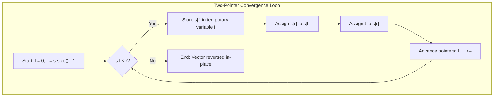

<h2><a href="https://leetcode.com/problems/reverse-string">344. Reverse String</a></h2>

<p>Write a function that reverses a string. The input string is given as an array of characters <code>s</code>.</p>

<p>You must do this by modifying the input array <a href="https://en.wikipedia.org/wiki/In-place_algorithm" target="_blank">in-place</a> with <code>O(1)</code> extra memory.</p>

<p>&nbsp;</p>
<p><strong class="example">Example 1:</strong></p>
<pre><strong>Input:</strong> s = ["h","e","l","l","o"]
<strong>Output:</strong> ["o","l","l","e","h"]
</pre><p><strong class="example">Example 2:</strong></p>
<pre><strong>Input:</strong> s = ["H","a","n","n","a","h"]
<strong>Output:</strong> ["h","a","n","n","a","H"]
</pre>
<p>&nbsp;</p>
<p><strong>Constraints:</strong></p>

<ul>
	<li><code>1 &lt;= s.length &lt;= 10<sup>5</sup></code></li>
	<li><code>s[i]</code> is a <a href="https://en.wikipedia.org/wiki/ASCII#Printable_characters" target="_blank">printable ascii character</a>.</li>
</ul>


---

# 🛍️ Reverse-String | Explained

## Approach 1: Two-Pointer In-Place Swap
### Intuition
Imagine two people standing at opposite ends of a narrow hallway lined with numbered tiles. To completely reverse the order of the hallway, the person at the left end and the person at the right end swap the tiles in front of them simultaneously. Once swapped, both take one step toward the center and repeat the process. When they meet in the middle or cross paths, every tile has been mirrored around the center point, achieving a complete reversal in-place without needing extra floor space.

### Algorithm Visualized



### Approach
1. **Initialize Pointers:** Set a left pointer `l` at the first index (`0`) and a right pointer `r` at the last index (`s.size() - 1`).
2. **Converge and Swap:** Execute a loop while `l < r`:
   - Store the character at index `l` into a temporary variable `t`.
   - Overwrite `s[l]` with `s[r]`.
   - Overwrite `s[r]` with the value stored in `t`.
3. **Move Pointers:** Increment `l` by `1` to move rightward and decrement `r` by `1` to move leftward.
4. **Termination:** When `l >= r`, all symmetric pairs have been swapped, and the middle element (if the array length is odd) remains in its correct central position.

### Detailed Code Analysis

```cpp
1class Solution {
2public:
3    void reverseString(vector<char>& s) {
4        int r = s.size()-1;
5        int l = 0;
6        while(l<r){
7            int t = s[l];
8            s[l] = s[r];
9            s[r] = t;
10            l++; r--;
11        }    
12    }
13};
```

- **Lines 4–5 (`int r = s.size()-1; int l = 0;`):** Initializes the two boundary pointers. `l` points to the start of the vector and `r` points to the last valid index.
- **Line 6 (`while(l<r)`):** The loop continues as long as `l` is strictly less than `r`. For arrays with an odd length, the middle element is skipped when `l == r`, which is optimal since swapping an element with itself is an unnecessary operation.
- **Lines 7–9 (`int t = s[l]; s[l] = s[r]; s[r] = t;`):** Performs a classic three-step variable swap:
  - `int t = s[l];` reads the byte at `s[l]` and stores its integer value (ASCII value) into a temporary stack variable `t`. While `char t` would be more type-accurate, C++ implicitly promotes `char` to `int` safely here.
  - `s[l] = s[r];` copies the character at the right index into the left index.
  - `s[r] = t;` writes the preserved original left character into the right index via implicit conversion from `int` back to `char`.
- **Line 10 (`l++; r--;`):** Moves both pointers closer to the center, ensuring the algorithm processes the next outer-most unswapped pair and guarantees termination in $\lfloor N/2 \rfloor$ iterations.

### Code
```cpp
class Solution {
public:
    void reverseString(vector<char>& s) {
        int r = s.size() - 1;
        int l = 0;
        while (l < r) {
            int t = s[l];
            s[l] = s[r];
            s[r] = t;
            l++; 
            r--;
        }    
    }
};
```

### Complexity
- **Time Complexity:** $\mathcal{O}(N)$ — The loop executes $\lfloor N/2 \rfloor$ times, where $N$ is the number of elements in `s`. Each iteration performs a constant number of $\mathcal{O}(1)$ operations (reads, writes, pointer arithmetic). Thus, the runtime scales linearly with the size of the input.
- **Space Complexity:** $\mathcal{O}(1)$ — The algorithm performs an in-place reversal using only three primitive stack variables (`l`, `r`, and `t`). No auxiliary memory structures or dynamic allocations are used.

---

## 🕵️‍♂️ Follow-up Questions (Optional)

1. **How would you make this code more idiomatic in Modern C++?**
   - Instead of manually declaring an intermediate variable `t`, you can use `std::swap(s[l], s[r])` or the standard algorithm `std::reverse(s.begin(), s.end())`. Both compile to highly optimized assembly instructions (often leveraging SIMD/vectorization instructions depending on optimization flags).

2. **How does this algorithm behave with Unicode / UTF-8 multi-byte characters?**
   - The current approach reverses raw `char` elements (single bytes). If the string contains multi-byte UTF-8 characters (like emojis or accented glyphs), swapping byte-by-byte will split multi-byte code units, resulting in corrupted or invalid characters. Handling UTF-8 correctly requires decoding the stream into Unicode code points or grapheme clusters before reversing.