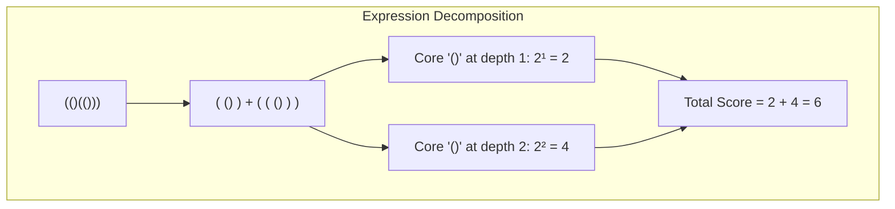
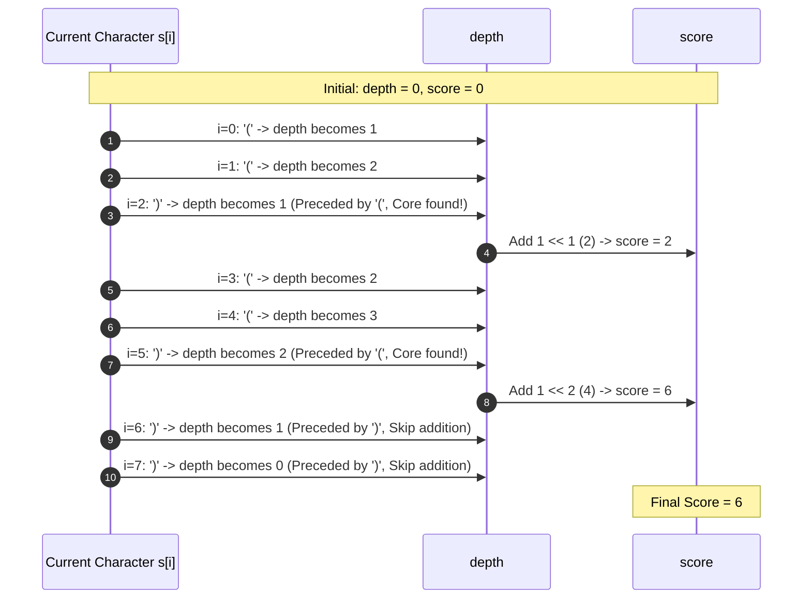

<h2><a href="https://leetcode.com/problems/score-of-parentheses">856. Score of Parentheses</a></h2>

<p>Given a balanced parentheses string <code>s</code>, return <em>the <strong>score</strong> of the string</em>.</p>

<p>The <strong>score</strong> of a balanced parentheses string is based on the following rule:</p>

<ul>
	<li><code>"()"</code> has score <code>1</code>.</li>
	<li><code>AB</code> has score <code>A + B</code>, where <code>A</code> and <code>B</code> are balanced parentheses strings.</li>
	<li><code>(A)</code> has score <code>2 * A</code>, where <code>A</code> is a balanced parentheses string.</li>
</ul>

<p>&nbsp;</p>
<p><strong class="example">Example 1:</strong></p>

<pre><strong>Input:</strong> s = "()"
<strong>Output:</strong> 1
</pre>

<p><strong class="example">Example 2:</strong></p>

<pre><strong>Input:</strong> s = "(())"
<strong>Output:</strong> 2
</pre>

<p><strong class="example">Example 3:</strong></p>

<pre><strong>Input:</strong> s = "()()"
<strong>Output:</strong> 2
</pre>

<p>&nbsp;</p>
<p><strong>Constraints:</strong></p>

<ul>
	<li><code>2 &lt;= s.length &lt;= 50</code></li>
	<li><code>s</code> consists of only <code>'('</code> and <code>')'</code>.</li>
	<li><code>s</code> is a balanced parentheses string.</li>
</ul>


---

# 🛍️ Score-of-Parentheses | Explained

## Approach 1: Bitwise Depth Tracking ($O(1)$ Space)

### Intuition
Think of parentheses as layers in an elevator or Russian nesting dolls. Every time you step inside an enclosing pair `(...)`, the value of whatever is inside gets doubled. 

By applying the distributive property of multiplication from elementary algebra:
$$2 \times (A + B) = 2A + 2B$$

This means we don't actually need to evaluate sub-expressions from the inside out using a stack or recursion. Instead, every balanced expression can be decomposed into a sum of powers of 2. Specifically, every core `()` pair contributes $2^{\text{depth}}$ to the total score, where $\text{depth}$ is the number of outer pairs enclosing it. Outer parentheses that enclose other expressions rather than forming the leaf pair `()` only serve to define the depth; they do not generate their own independent base points.

### Algorithm Visualized

For the input string `s = "(()(()))"`:



Trace of pointer execution across `(()(()))`:



### Approach
1. **Maintain running counters**: Track the current nesting level (`depth`) and the accumulated points (`score`).
2. **Handle Opening Brackets `(`**: Increment `depth` by 1.
3. **Handle Closing Brackets `)`**:
   - Decrement `depth` first. This aligns the 0-indexed exponent with the current layer.
   - Check if this closing bracket immediately follows an opening bracket (`s[i - 1] == '('`). 
   - If it does, we have encountered an irreducible `()` unit. Add $2^{\text{depth}}$ to `score`. Using the bitwise shift operator `1 << depth` computes $2^{\text{depth}}$ in $O(1)$ CPU cycles.
   - If it does not, this closing bracket is just sealing an outer compound expression (e.g., the final bracket in `(())`). Its multiplicative effect has already been accounted for by the nested leaf nodes.
4. **Return**: The final accumulated `score`.

### Detailed Code Analysis

```cpp
1class Solution {
2public:
3    int scoreOfParentheses(string s){
4        int score = 0, depth = 0;
```
- **Lines 3–4**: Initialize `score` and `depth` to `0`. Because we only need the count of active open layers, an integer variable replaces the need for an explicit stack data structure (e.g., `std::stack<int>`).

```cpp
5        for(int i = 0; i < s.size(); ++i){
6            if(s[i] == '('){
7                ++depth;
8            } 
```
- **Lines 5–8**: Iterate through each character of the string. When `s[i] == '('`, an open scope begins, so `depth` is incremented.

```cpp
9            else{
10                --depth;
11                if(s[i - 1] == '('){
12                    score += 1 << depth;
13                }
14            }
```
- **Line 10**: We encounter `)`. The current scope is ending, so `depth` is immediately decremented. 
- **Line 11**: `if(s[i - 1] == '(')` detects whether the current `)` is part of an atomic `()` pair. 
  - Note: This index lookup is guaranteed safe without an `i > 0` bounds check because any valid parentheses string must start with `(`, ensuring that the first time this `else` branch is entered, `i >= 1`.
- **Line 12**: `score += 1 << depth;` executes only for atomic pairs. Because `depth` was already decremented on line 10, an atomic pair at the root level (depth 1 before decrement) evaluates to `1 << 0 = 1`. An atomic pair nested inside one outer pair (depth 2 before decrement) evaluates to `1 << 1 = 2`, which corresponds to $2^1$.

```cpp
15        }
16        return score;
17    }
18};
```
- **Lines 15–17**: Once the loop finishes, all leaf pairs have contributed their multiplied values to `score`. Return `score`.

### Code

```cpp
class Solution {
public:
    int scoreOfParentheses(string s) {
        int score = 0, depth = 0;
        for (int i = 0; i < s.size(); ++i) {
            if (s[i] == '(') {
                ++depth;
            } else {
                --depth;
                if (s[i - 1] == '(') {
                    score += 1 << depth;
                }
            }
        }
        return score;
    }
};
```

### Complexity
- **Time:** $O(N)$, where $N$ is the length of string `s`. The algorithm scans the string exactly once in a single pass. Bitwise shifting and arithmetic operations execute in $O(1)$ time per character.
- **Space:** $O(1)$ auxiliary space. Only two primitive integer variables (`score` and `depth`) are maintained, achieving optimal spatial complexity without allocating a dynamic stack.

---

## 🕵️‍♂️ Follow-up Questions

### 1. Integer Overflow Vulnerability
* **Question:** What happens if the input string contains more than 30 consecutively nested parentheses (e.g., `((((...()))))` with depth $\ge 31$)?
* **Answer:** In C++, `1 << depth` performs a left shift on a signed 32-bit integer literal `1`. If `depth >= 31`, this leads to undefined behavior due to signed integer overflow (or negative numbers). To protect against deep nesting while remaining within LeetCode constraints, cast the operand to a 64-bit integer (`1LL << depth`) or guard against maximum depth if inputs can be arbitrarily large.

### 2. Generalizing Multipliers
* **Question:** How would this approach change if the multiplier rule changed from doubling `(A) = 2 * A` to tripling `(A) = 3 * A`, or if each level added dynamic weights?
* **Answer:** Bit shifting (`1 << depth`) only works for base-2 arithmetic. If the multiplier changes to a constant $k$ (e.g., $k = 3$), bit shifts must be replaced with modular exponentiation or precomputed powers: `std::pow(3, depth)`. If weights are non-uniform across levels, you must revert to the classic **Stack-based evaluation** approach where intermediate frame scores are accumulated dynamically.