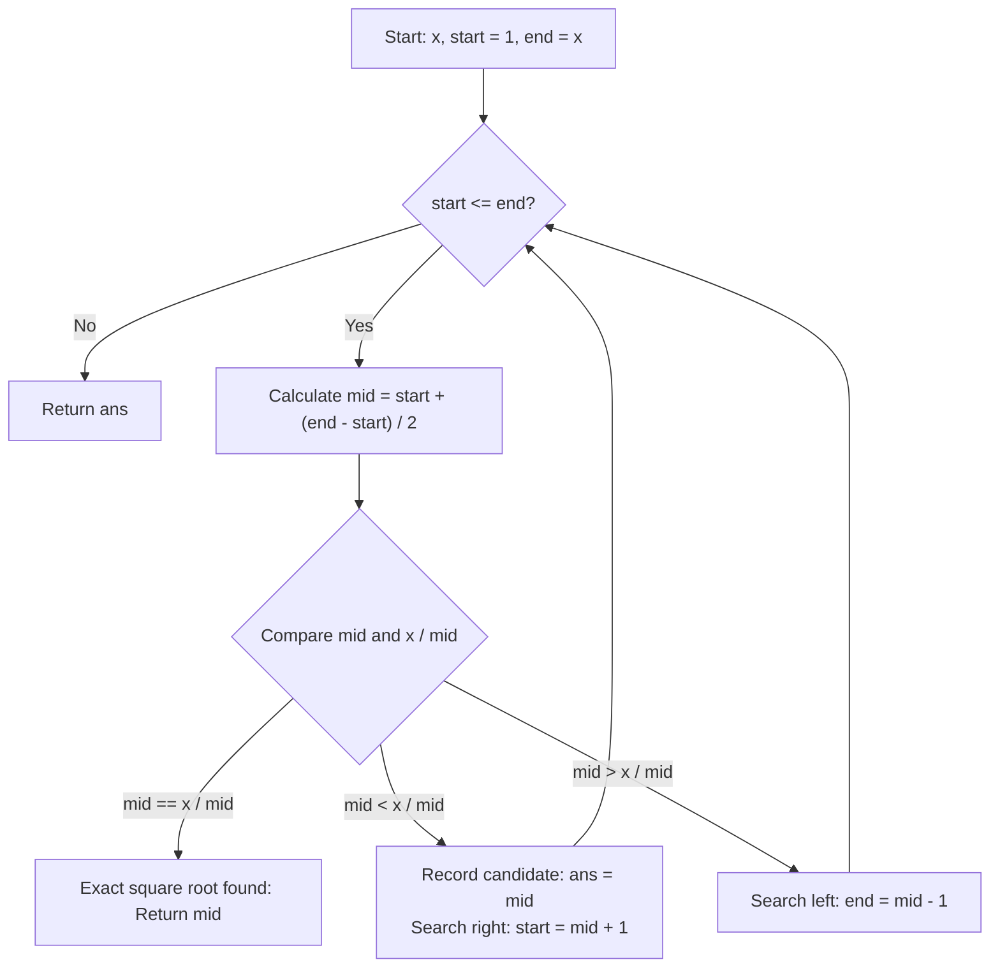

<h2><a href="https://leetcode.com/problems/sqrtx">0000. Sqrtx</a></h2>

<p>Given a non-negative integer <code>x</code>, return <em>the square root of </em><code>x</code><em> rounded down to the nearest integer</em>. The returned integer should be <strong>non-negative</strong> as well.</p>

<p>You <strong>must not use</strong> any built-in exponent function or operator.</p>

<ul>
	<li>For example, do not use <code>pow(x, 0.5)</code> in c++ or <code>x ** 0.5</code> in python.</li>
</ul>

<p>&nbsp;</p>
<p><strong class="example">Example 1:</strong></p>

<pre><strong>Input:</strong> x = 4
<strong>Output:</strong> 2
<strong>Explanation:</strong> The square root of 4 is 2, so we return 2.
</pre>

<p><strong class="example">Example 2:</strong></p>

<pre><strong>Input:</strong> x = 8
<strong>Output:</strong> 2
<strong>Explanation:</strong> The square root of 8 is 2.82842..., and since we round it down to the nearest integer, 2 is returned.
</pre>

<p>&nbsp;</p>
<p><strong>Constraints:</strong></p>

<ul>
	<li><code>0 &lt;= x &lt;= 2<sup>31</sup> - 1</code></li>
</ul>


---

# 🛍️ Sqrtx | Explained

## Approach 1: Binary Search with Division-Based Overflow Avoidance
### Intuition
Finding the integer square root of a non-negative integer $x$ is equivalent to finding the largest integer $k$ such that $k^2 \le x$. Because the squares of positive integers are strictly monotonically increasing ($1^2 < 2^2 < 3^2 < \dots < k^2$), the search space from $1$ to $x$ is inherently sorted.

Think of it like playing a classic higher/lower number-guessing game. If your guess squared exceeds the target, you know for certain that every number greater than your guess will also be too large. Conversely, if your guess squared is less than or equal to the target, it becomes a valid candidate, and you only need to explore higher numbers to check if a tighter integer floor exists.

### Algorithm Visualized


### Approach
1. **Edge Case Handling:** For $x = 0$ or $x = 1$, the integer square root is $x$ itself. Return immediately.
2. **Search Range Initialization:** Set the lower bound `start = 1` and the upper bound `end = x`. Maintain a variable `ans` to store the latest valid lower bound candidate where $mid^2 \le x$.
3. **Binary Search Iteration:**
   - Compute the midpoint safely to avoid 32-bit signed integer overflow: `mid = start + (end - start) / 2`.
   - Compare `mid` against `x / mid` instead of computing `mid * mid`, avoiding integer overflow when $mid$ is large (e.g., $mid \approx 2^{31}-1$).
   - **Case 1 (`mid == x / mid`):** `mid` is the exact square root. Return `mid`.
   - **Case 2 (`mid < x / mid`):** `mid` is smaller than the target root. Store `ans = mid` as the best candidate so far, and shift the search boundary rightward by setting `start = mid + 1`.
   - **Case 3 (`mid > x / mid`):** `mid` is strictly greater than the target root. Discard `mid` and the upper half by setting `end = mid - 1`.
4. **Termination:** When `start > end`, return the stored floor value `ans`.

### Detailed Code Analysis
- **Lines 4:** `if (x == 0 || x == 1) return x;`
  - Instantly resolves base cases where $0^2 = 0$ and $1^2 = 1$, avoiding unnecessary loops and potential division by zero when calculating `x / mid`.
- **Lines 5–7:** `int start = 1; int end = x; int ans = 0;`
  - Defines the search boundaries and initializes the accumulator `ans`.
- **Line 8:** `while (start <= end)`
  - Standard binary search loop that continues as long as a valid search interval remains.
- **Line 9:** `int mid = start + (end - start) / 2;`
  - Calculates the midpoint using subtraction rather than `(start + end) / 2` to prevent standard arithmetic overflow when `start + end > INT_MAX`.
- **Lines 10–12:** `if (mid == x / mid) { return mid; }`
  - Checks if $mid^2 == x$. Using `x / mid` ensures the multiplication does not overflow a standard 32-bit signed integer. If equal, `mid` is returned immediately.
- **Lines 13–16:** `else if (mid < x / mid) { ans = mid; start = mid + 1; }`
  - Satisfies $mid^2 < x$. `mid` is a valid lower bound, so it is saved in `ans`. The search space is reduced to the right half `[mid + 1, end]` to find a potentially larger valid integer.
- **Lines 17–19:** `else { end = mid - 1; }`
  - Satisfies $mid^2 > x$. `mid` is too large to be the square root. The search space is reduced to the left half `[start, mid - 1]`.
- **Line 21:** `return ans;`
  - Returns the highest integer whose square does not exceed $x$.

### Code
```cpp
class Solution {
public:
    int mySqrt(int x) {
        if (x == 0 || x == 1) return x;
        int start = 1;
        int end = x;
        int ans = 0;
        while (start <= end) {
            int mid = start + (end - start) / 2;
            if (mid == x / mid) {
                return mid;
            } 
            else if (mid < x / mid) {
                ans = mid;     
                start = mid + 1; 
            } 
            else {
                end = mid - 1;   
            }
        }
        return ans;
    }
};
```

### Complexity
- **Time:** $O(\log x)$ — The search range $[1, x]$ is halved in each step of the binary search, requiring at most $\approx \log_2(x)$ iterations.
- **Space:** $O(1)$ — Only a few scalar integer variables (`start`, `end`, `mid`, `ans`) are used, requiring constant auxiliary memory.

---

## 🕵️‍♂️ Follow-up Questions (Optional)

1. **How can this problem be solved using Newton-Raphson method (Heron's method)?**
   - We find the zero of the function $f(y) = y^2 - x$ using the iterative recurrence $y_{k+1} = \frac{1}{2} \left(y_k + \frac{x}{y_k}\right)$. Starting from an initial guess $y_0 = x$, the sequence converges quadratically to $\lfloor \sqrt{x} \rfloor$ in $O(\log(\log x))$ steps.

2. **What if the problem asked for precision up to $k$ decimal places instead of the integer floor?**
   - The binary search approach can be adjusted for floating-point numbers: change the loop condition from `while (start <= end)` to `while (end - start > epsilon)`, where $\text{epsilon} = 10^{-(k+1)}$. At that point, operations would use `double` precision arithmetic without integer truncation.