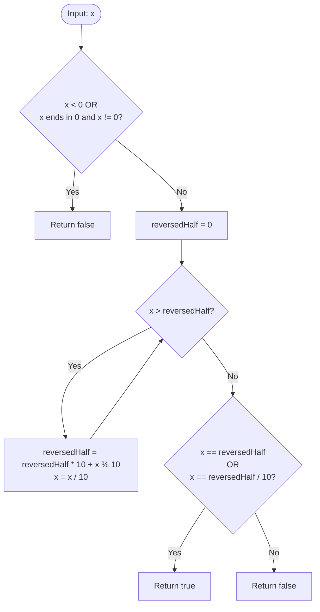

<h2><a href="https://leetcode.com/problems/palindrome-number">9. Palindrome Number</a></h2>

<p>Given an integer <code>x</code>, return <code>true</code> if <code>x</code> is a <span data-keyword="palindrome-integer" class=" cursor-pointer relative text-dark-blue-s text-sm"><button type="button" aria-haspopup="dialog" aria-expanded="false" aria-controls="radix-_r_s_" data-state="closed" class=""><strong>palindrome</strong></button></span>, and <code>false</code> otherwise.</p>

<p>&nbsp;</p>
<p><strong class="example">Example 1:</strong></p>

<pre><strong>Input:</strong> x = 121
<strong>Output:</strong> true
<strong>Explanation:</strong> 121 reads as 121 from left to right and from right to left.
</pre>

<p><strong class="example">Example 2:</strong></p>

<pre><strong>Input:</strong> x = -121
<strong>Output:</strong> false
<strong>Explanation:</strong> From left to right, it reads -121. From right to left, it becomes 121-. Therefore it is not a palindrome.
</pre>

<p><strong class="example">Example 3:</strong></p>

<pre><strong>Input:</strong> x = 10
<strong>Output:</strong> false
<strong>Explanation:</strong> Reads 01 from right to left. Therefore it is not a palindrome.
</pre>

<p>&nbsp;</p>
<p><strong>Constraints:</strong></p>

<ul>
	<li><code>-2<sup>31</sup>&nbsp;&lt;= x &lt;= 2<sup>31</sup>&nbsp;- 1</code></li>
</ul>

<p>&nbsp;</p>
<strong>Follow up:</strong> Could you solve it without converting the integer to a string?

---

# 🛍️ Palindrome-Number | Explained

## Approach 1: Reversing Half of the Number

### Intuition
Think of a palindrome like folding a piece of paper in half. If the crease divides two identical mirror images, the whole sheet is symmetric. 

Instead of converting the integer to a string (which uses extra memory) or reversing the entire integer (which risks a 32-bit signed integer overflow when the reversed number exceeds `2^31 - 1`), we can reverse only the second half of the number. Once the reversed second half meets or exceeds the remaining first half, we stop and compare them directly.

### Algorithm Visualized



### Approach
1. **Filter Edge Cases**:
   - Negative numbers can never be palindromes due to the leading minus sign (e.g., `-121` reversed is `121-`).
   - Numbers ending in `0` cannot be palindromes unless the number itself is `0` (e.g., `10` reversed is `01`, which is not equal).
2. **Reverse the Trailing Digits**:
   - Continuously pop the last digit of `x` (`x % 10`) and push it to `reversedHalf` (`reversedHalf * 10 + digit`).
   - Reduce `x` by dividing by `10`.
   - Stop when `x <= reversedHalf`, which signifies that we have reached or crossed the middle point of the number.
3. **Compare Halves**:
   - **Even number of digits** (e.g., `1221`): At the end of the loop, `x = 12` and `reversedHalf = 12`. We check `x == reversedHalf`.
   - **Odd number of digits** (e.g., `12321`): At the end of the loop, `x = 12` and `reversedHalf = 123`. The middle digit (`3`) does not affect palindrome properties, so we check `x == reversedHalf / 10`.

### Detailed Code Analysis

- **Lines 4–6:**
  ```cpp
  if (x < 0 || (x % 10 == 0 && x != 0)) {
      return false;
  }
  ```
  Immediately discards negative values and non-zero numbers ending in zero. This is crucial because a trailing zero would become a leading zero in the reversed half, which standard integers cannot represent directly.

- **Line 7:**
  ```cpp
  int reversedHalf = 0;
  ```
  Initializes the accumulator variable that will store the reversed second half of the digits.

- **Lines 8–11:**
  ```cpp
  while (x > reversedHalf) {
      reversedHalf = reversedHalf * 10 + x % 10;
      x /= 10;
  }
  ```
  This is the core loop. By comparing `x > reversedHalf`, the loop terminates as soon as `reversedHalf` has at least as many digits as `x`. 
  - `x % 10` extracts the rightmost digit.
  - `reversedHalf * 10 + ...` shifts existing reversed digits to the left and appends the new digit.
  - `x /= 10` truncates the processed digit from `x`.

- **Line 12:**
  ```cpp
  return x == reversedHalf || x == reversedHalf / 10;
  ```
  Evaluates the symmetry:
  - If the original digit length was even, `x` must match `reversedHalf` exactly.
  - If the original digit length was odd, `reversedHalf / 10` strips off the middle digit (which is at the units place of `reversedHalf`), allowing a direct comparison with `x`.

### Code
```cpp
class Solution {
public:
    bool isPalindrome(int x) {
        if (x < 0 || (x % 10 == 0 && x != 0)) {
            return false;
        }
        int reversedHalf = 0;
        while (x > reversedHalf) {
            reversedHalf = reversedHalf * 10 + x % 10;
            x /= 10;
        }
        return x == reversedHalf || x == reversedHalf / 10;
    }
};
```

### Complexity
- **Time:** $\mathcal{O}(\log_{10}(n))$ — In each iteration, we divide the input by $10$. Because we only process half of the digits, the while loop runs at most $\frac{\log_{10}(n)}{2}$ times.
- **Space:** $\mathcal{O}(1)$ — No heap allocation or extra collections are used; only two primitive integer variables (`x` and `reversedHalf`) are maintained in memory.

---

## 🕵️‍♂️ Follow-up Questions

1. **Why does this approach guarantee no 32-bit integer overflow?**
   - Since we only reverse up to half of the number's total digits, `reversedHalf` can never exceed $\sqrt{x_{original}} \times 10$, which is at most $5$ digits for a 32-bit signed integer (max value `2,147,483,647` has $10$ digits). Thus, `reversedHalf` will never exceed `INT_MAX`.

2. **Can this be solved by comparing the most-significant and least-significant digits directly?**
   - Yes. You can compute the highest divisor power of 10 (e.g., `divisor = 10000` for `12321`), compare `x / divisor` with `x % 10`, and then shrink `x` via `(x % divisor) / 10` and `divisor /= 100`. However, that approach requires an extra loop to calculate the initial divisor and more operations per iteration.